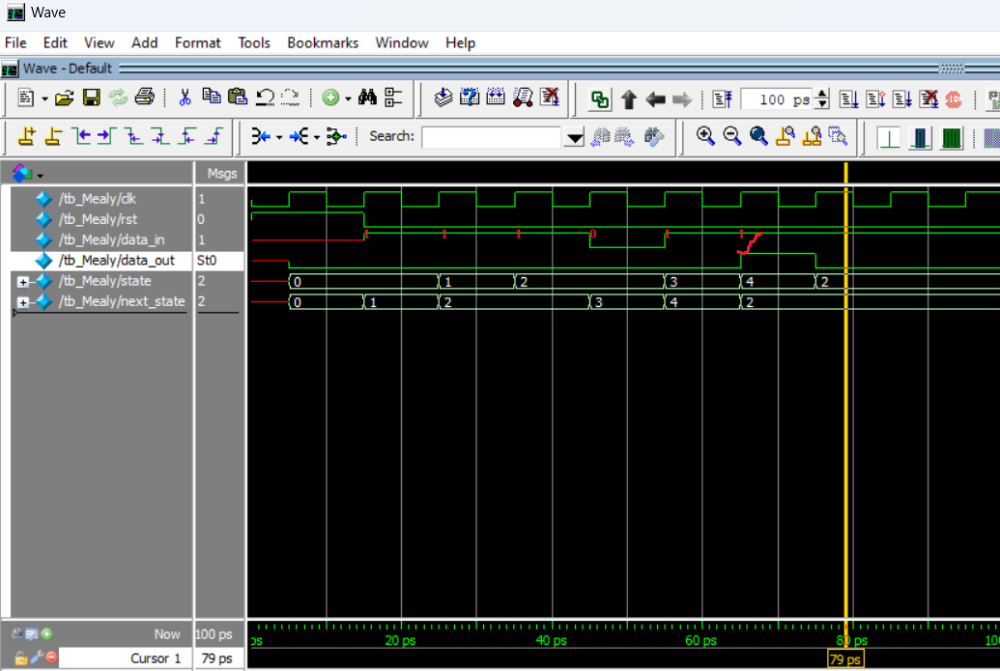
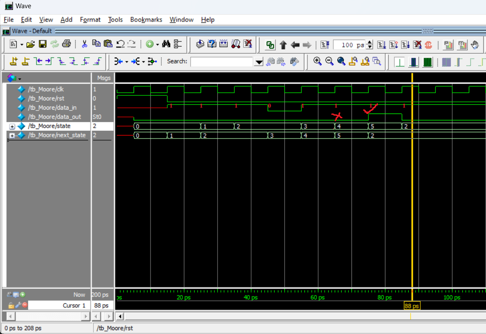

In this little project, Ive written a program involving usage of FSM. As you'all know we have Mealy State and Moore State Machines so, Ive written a Program based on
sequence detector. The sequence detector is going to take inputs serially and if it detects the pattern **11011** its going to output **1** and if it doesnt then its 
going to output **0**. Also Ive considered the possibility of overlapping of bits. 
Here is the timing diagrams of the both State Machine codes.

<h3> MEALY TIMING</h3>

As you can see as soon as we get 11011 sequence we are getting the output in that state itself so output is the function of input as well as current state.

<h3> MOORE TIMING</h3>

As you can see even though we get 11011 sequence but in the next state we are getting the output so output is function of only current state.

